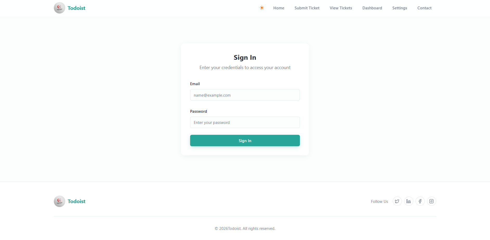
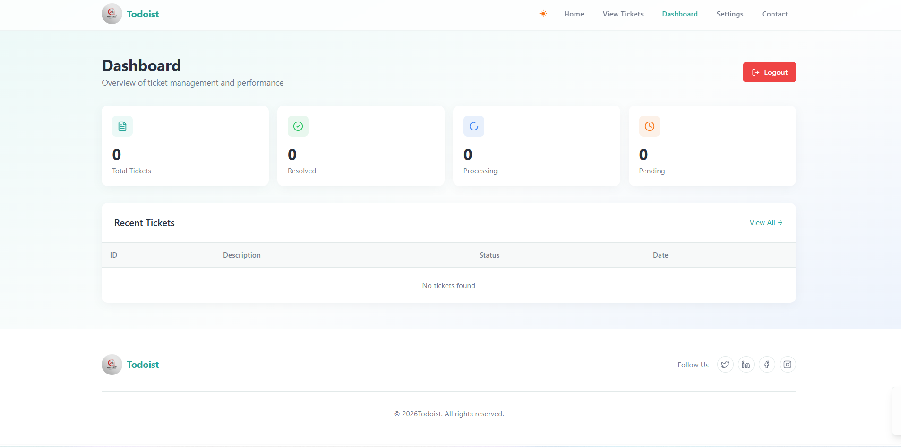
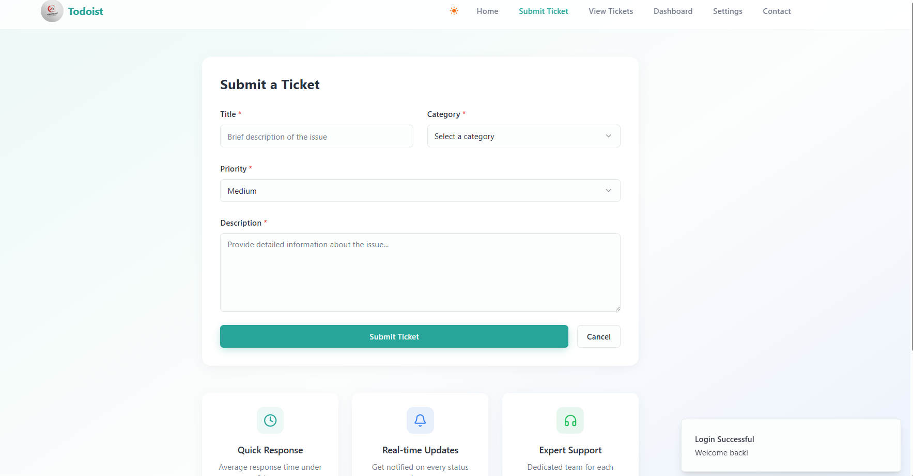

# Todoist - Ticket Raising Platform 🚀

## 📖 Overview

The **Ticket Raising Platform** is a state-of-the-art enterprise solution designed to streamline internal issue tracking and resolution. Built with a **FastAPI** backend and a **Modern React** frontend, this application features a premium **Glassmorphism UI** inspired by MacOS aesthetics. It bridges the gap between employees and support staff through an intuitive, reliable, and aesthetically pleasing interface.

## ✨ Key Features

### 🎨 Design & Experience
- **Premium Glassmorphism UI**: A visually stunning interface consisting of frosted glass cards, vibrant gradients, and smooth animations.
- **Adaptive Dark Mode**: Seamless transition between Light and "Deep Black" Dark modes with fluid aesthetic adjustments.
- **Responsive Layout**: A mobile-first design that adapts perfectly from desktops to smartphones.

### 🛠️ Functional Modules
- **🔐 Role-Based Access Control (RBAC)**: Secure login for **Admins** and **Employees** with distinct dashboards.
- **📊 Admin Dashboard**:
  - Real-time statistics (Total Tickets, Solved, Pending).
  - Interactive monthly performance graphs (Area Charts).
  - Quick-action table to update ticket statuses (`Resolved`, `Processing`, `On Hold`).
- **🎫 User Dashboard**:
  - Simple "Raise a Ticket" workflow.
  - Live status tracking of submitted complaints.
  - History view of all past interactions.

---

## 🏗️ Architecture

The system follows a decoupled **Client-Server Architecture**:

```text
    ┌──────────────┐          ┌───────────────────┐          ┌───────────────────┐          ┌───────────────────┐
    │  User/Admin  │          │   React Frontend  │          │  FastAPI Backend  │          │   PostgreSQL DB   │
    │  (Browser)   │ ───────► │       (Vite)      │ ───────► │      (Python)     │ ───────► │    (SQLAlchemy)   │
    └──────────────┘          └───────────────────┘          └───────────────────┘          └───────────────────┘
           ▲                            │                              │                              │
           └────────────────────────────┴──────────────────────────────┴──────────────────────────────┘
                                     HTTP / JSON Response Flow
```

### 💻 Technology Stack

| Logic Layer | Technology Used |
| :--- | :--- |
| **Frontend** | React 18, Vite, Tailwind Concepts (Custom CSS), Framer Motion, Recharts |
| **Backend** | Python 3.10+, FastAPI, Pydantic, SQLAlchemy |
| **Database** | PostgreSQL (Production), SQLite (Development) |
| **Authentication** | OAuth2 with Password Flow (JWT Tokens) |
| **Styling** | CSS3 Variables, Backdrop-Filters, Lucide React Icons |

---

## 📸 Screenshots

### 1. Login Page
*A sleek, glass-styled entry point for all users.*


### 2. Admin Dashboard (Dark Mode)
*Comprehensive overview with graphs and ticket management tools.*


### 3. Ticket Creation & User Panel
*Intuitive form for raising new issues.*


---

## 🚀 Getting Started (Assignment Submission)

### 1️⃣ Setup Instructions
1.  **Clone/Unzip** the project.
2.  **Environment Variables**:
    - Pass your OpenAI API Key in `docker-compose.yml` (environment: `OPENAI_API_KEY`) or create a `.env` file if configured.
    - Default is set to `${OPENAI_API_KEY}`.
3.  **Run with Docker**:
    - **Important**: If you have run this project before, please reset the database volume to apply new schema changes:
      ```bash
      docker-compose down -v
      ```
    - Start the application:
      ```bash
      docker-compose up --build
      ```
4.  **Access**:
    - **Frontend**: http://localhost:5173
    - **Backend API**: http://localhost:8000/docs
    - **Credentials** (Pre-created):
        - Admin: `admin@example.com` / `admin123`
        - User: `user@example.com` / `user123`

### 🤖 LLM Integration
- **LLM Chosen**: **Google Gemini (gemini-1.5-flash)**.
- **Reason**: It is a highly capable and cost-effective (free tier available) model that excels at classification tasks.
- **Failover**: The system includes graceful error handling. If the API key is missing or the API call fails, it defaults to `General` / `Medium` without blocking the user.
- **Prompt**: Located in `backend/app/services/llm_service.py`. It uses a rigid system prompt to enforce JSON output.

### 📐 Design Decisions
- **Backend**: Struck to **FastAPI** as requested, simulating the Django requirements using Pydantic schemas and SQLAlchemy models.
- **Database**: Used **PostgreSQL** in Docker. Implemented DB-level aggregation for stats using SQLAlchemy queries.
- **Frontend**: **React** with **TanStack Query (React Query)** for efficient data fetching and caching. Used **Tailwind CSS** components for a clean UI.
- **Separation of Concerns**: Logic for LLM is isolated in a service layer. API call logic is centralized in `frontend/src/lib/api.js`.

---

## 📂 Project Structure

```
TicketRaising/
├── backend/                # FastAPI Application
│   ├── app/
│   │   ├── routers/        # API Endpoints (Auth, Tickets, Users)
│   │   ├── models/         # Database Models
│   │   └── schemas/        # Pydantic Schemas
│   │   └── main.py         # Entry Point
│
├── frontend/               # React Application
│   ├── src/
│   │   ├── components/     # Reusable UI (Navbar, GlassCard)
│   │   ├── pages/          # Application Pages (Dashboard, Login)
│   │   ├── utils/          # Helpers (MockData)
│   │   └── index.css       # Global Styles & Glassmorphism Logic
│   └── vite.config.js      # Vite Configuration
│
└── README.md               # Project Documentation
```

## 🤝 Contributing
Contributions are welcome! Please reach out to the development team at **Todoist Pvt Ltd.** for access.

---

© 2024 Todoist Pvt Ltd. All rights reserved.
