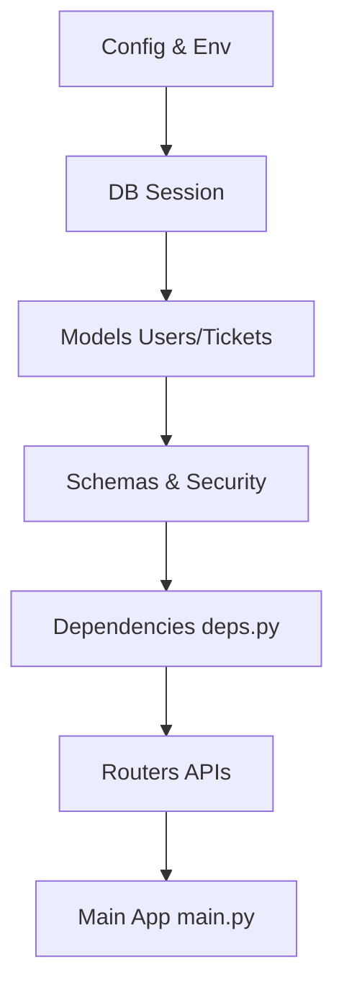

# Project Implementation Flow (Kaise Banaya Project)

Here is the step-by-step flow of how this Tickets Raising Platform project was essentially built. Backend development hamesha **Bottom-Up** approach follow karta hai (Base -> Database -> Logic -> APIs).

---

## **Phase 1: Foundation (Sabse Pehle)**
Before writing any complex logic, we set up the environment.

1.  **`requirements.txt`**
    *   **Why:** Sabse pehle humne decide kiya ki humein kya tools chahiye (FastAPI for web, SQLAlchemy for DB, Alembic for migrations).
    *   **Action:** Installed dependencies using `pip install -r requirements.txt`.

2.  **`.env` & `app/core/config.py`**
    *   **Why:** Hardcoding passwords/URLs is bad.
    *   **Action:**
        *   `.env` file banayi secrets store karne ke liye.
        *   `app/core/config.py` create kiya taaki poore project mein variables ek hi jagah se access hon (`settings.DATABASE_URL`).

---

## **Phase 2: Database Layer (Storage Layer)**
Code likhne se pehle Data ka structure decide karna zaroori hai.

3.  **`app/db/session.py`**
    *   **Why:** Database se disconnect/connect karne ka logic chahiye tha.
    *   **What:** `SessionLocal` aur `get_db` banaya jo har request ke liye connection handle karega.

4.  **`app/models/*.py` (The "What")**
    *   **Why:** Tables define karne the.
    *   **Order:**
        1.  `enums.py`: Pehle Roles (`AdminRole`) aur Status (`TicketStatus`) define kiye.
        2.  `user.py`: `User` aur `Admin` tables banaye.
        3.  `ticket.py`: `Ticket` table banaya jo User aur Admin se link (ForeignKey) hota hai.

5.  **`alembic/` (Migrations)**
    *   **Why:** Python models ko actual SQL Database tables mein convert karne ke liye.
    *   **Action:** Ran `alembic init` & `alembic upgrade head`.

---

## **Phase 3: Core Logic & Security**
Ab database ready hai, ab safety aur data validation set kiya.

6.  **`app/schemas/*.py` (The "Shape")**
    *   **Why:** API mein data kaisa dikhega (Input/Output validation).
    *   **What:** Pydantic models banaye (e.g., `TicketCreate`, `UserResponse`).

7.  **`app/core/security.py`**
    *   **Why:** Passwords hash karne aur JWT tokens banane ke liye.
    *   **What:** `verify_password`, `get_password_hash`, aur `create_access_token` functions likhe.

---

## **Phase 4: API Building (The Logic)**
Yeh wo part hai jahan actual kaam hota hai (Endpoints).

8.  **`app/routers/deps.py` (Dependencies)**
    *   **Why:** Har API endpoint pe bar-bar check karne ke bajaye ek common checker chahiye tha.
    *   **What:** `get_current_user`, `require_senior_admin` logic yahan likha taaki routes clean rahein.

9.  **`app/routers/*.py` (Endpoints)**
    *   **Order:**
        1.  `auth.py`: Login logic pehle chahiye taaki token mile.
        2.  `users.py` / `admins.py`: Users create/manage karne ka logic.
        3.  `tickets.py`: Main business logic (Create ticket, Update status, Upload file).

---

## **Phase 5: Assembly & Launch**
Sab kuch connect karna.

10. **`app/main.py`**
    *   **Why:** Entry point jahan FastAPI initialize hota hai.
    *   **Action:** Saare routers (`auth`, `ticket`, `admin`) ko include kiya aur Static Files (`uploads/`) mount kiye.

11. **`reset_admin.py` (Helper Script)**
    *   **Why:** System login karne ke liye kam se kam ek Admin chahiye tha.
    *   **Action:** Ye script likhi jo manually database mein ek Super Admin inject karti hai taaki aap pehli baar login kar sakein.

---

### **Summary Flowchart**

